---

Static Xubuntu website running on [Hugo](https://gohugo.io/), a Go framework for building websites.

- [Repo Navigation](#repo-navigation)
  - [File tree description](#file-tree-description)
    - [Xubuntu (Hugo) Theme](#xubuntu-hugo-theme)
  - [Skeleton diagram](#skeleton-diagram)
- [Quick start | Hugo](#quick-start--hugo)
- [Add release content](#add-release-content)
- [Contribute](#contribute)

# Repo Navigation

## File tree description

<pre><code>
xubuntu-website-next-hugo/
├── .github/
│   └── workflows/
│       └── hugo.yml     <-- Build the website with Hugo & deploy to Github Pages
├── content     <-- Website content
│   ├── news     <-- Blog page content
│   │   ├── YYYY
│   │   │   ├── YYYY-MM-DD-...-...-...
│   │   │   │   ├── index.md
│   │   │   │   ├── ....jpg
│   │   │   ├── ...
│   │   ├── ...
│   │   ├── releases
│   │   │   ├── XX.XX
│   │   │   │   ├── YYYY-MM-DD-xubuntu-XX-XX-released
│   │   │   │   │   ├── index.md
│   │   │   │   │   └── xubuntu-XX.XX.png
│   │   │   │   ├── ...
│   │   │   ├── ...
│   ├── press     <-- YT Vid links
│   │   ├── XX.XX.md
│   │   ├── ...
│   ├── release     <-- Minimum info on the release (YAML: [title, version, version_point, codename, codename_slug, date_rel, date_eol, products, architectures, lts] , desc)
│   │   ├── XX.XX
│   │   │   └── index.md
│   │   ├── ...
│   ├── releasedocs     <-- Release & Migration/Upgrade Notes
│   │   ├── XX.XX
│   │   │   ├── release-notes.md
│   │   │   └── upgrading.md
│   │   ├── ...
│   ├── _index.html     <-- `Homepage` page
│   ├── contribute.html     <-- `Contribute` page
│   ├── download.html     <-- `Download` page
│   ├── help.html     <-- `Support` page
│   └── releases.html     <-- `All releases` page
├── data
│   └── mirrors.yml     <-- Mirror info (checksums(VER), servers: [name, country, url(VER), info, major])
├── layouts
│   └── partials
│       └── header-home.html
├── themes
│   └── xubuntu     <-- Xubuntu (Hugo) Theme
│       ├── _sources
│       │   ├── assets
│       │   │   └── images 
│       │   ├── static
│       │   │   └── images
│       │   └── Makefile
│       ├── archetypes
│       │   └── default.md
│       ├── assets
│       │   ├── css
│       │   │   ├── animations.css
│       │   │   ├── fonts.css
│       │   │   ├── main.css
│       │   │   └── reset.css
│       │   ├── images
│       │   └── js
│       │       └── main.js
│       ├── layouts
│       │   ├── _default
│       │   │   ├── baseof.html
│       │   │   ├── home.html
│       │   │   ├── list.html
│       │   │   └── single.html
│       │   ├── news
│       │   │   ├── list.html
│       │   │   └── single.html
│       │   ├── partials
│       │   │   ├── head
│       │   │   │   ├── css.html
│       │   │   │   └── js.html
│       │   │   ├── footer.html
│       │   │   ├── head.html
│       │   │   ├── header.html
│       │   │   ├── menu.html
│       │   │   ├── news-single.html
│       │   │   ├── pagination.html
│       │   │   ├── release-downloads.html
│       │   │   ├── releases-supported.html
│       │   │   └── releases-unsupported.html
│       │   ├── release
│       │   │   └── single.html
│       │   ├── releases
│       │   │   └── single.html
│       │   └── shortcodes
│       │       ├── figure.html
│       │       ├── icon-with-content.html
│       │       ├── icon.html
│       │       ├── latest-news.html
│       │       ├── latest-release.html
│       │       ├── release-buttons-supported.html
│       │       └── release-downloads-supported.html
│       ├── static
│       │   ├── fonts
│       │   ├── images
│       │   └── favicon.ico
│       ├── LICENSE
│       ├── README.md
│       └── theme.toml
├── README.md
└── hugo.yaml     <-- Website info (baseURL, languageCode, title, theme (xubuntu), menus: main: [name, pageRef, weight])
</code></pre>

> [!NOTE]
> All Blog articles are displayed regardless of directory hierarchy inside `content/news`.

### Xubuntu (Hugo) Theme

For a dive into the file structure of the Xubuntu (Hugo) Theme ([`themes/xubuntu`](./themes/xubuntu)), see [Directory structure | Hugo](https://gohugo.io/getting-started/directory-structure/) **Directories** section.

## Skeleton diagram

```mermaid
flowchart TB

    C_H --> LP_1
    C_H --> LP_3

    LS_A -- included in --> C_A --> W_A
    LP_1 -- used as list in --> LS_A
    LP_2 -- included in --> LS_A
    LP_1 -- used as list in --> LS_B -- included in --> C_B --> W_B
    C_C --> W_C
    LP_1 -- used as list in --> LRs
    LP_3 -- used as list in --> LRs
    LRs --> C_E --> W_E
    LS_C -- included in --> C_F
    C_D --> LS_C
    
    LP_1 -- used as list in --> LS_D -- included in --> C_F
    C_F --> W_F

    LP_D --> LN_A
    LP_E --> LN_A
    C_D  --> LN_A
    LP_D --> LN_B
    C_D --> LN_B

    LN_A --> W_D
    LN_B --> W_DS

    C_I --> LR
    C_D --> LR
    C_G --> LR
    LP_2 --> LR

    W_D --> W_DS
    W_E --> W_ES

    C_I --> W_ESD

    LR --> W_ES --> W_ESD

    subgraph "<code>themes/xubuntu/layouts/</code>"
        subgraph "<code>shortcodes/</code>"
            LS_A[<a href="themes/xubuntu/layouts/shortcodes/release-downloads-supported.html"><code>release-downloads-supported.html</code></a>]
            LS_B[<a href="themes/xubuntu/layouts/shortcodes/release-buttons-supported.html"><code>release-buttons-supported.html</code></a>]
            LS_C[<a href="themes/xubuntu/layouts/shortcodes/latest-news.html"><code>latest-news.html</code></a><hr>list and display news by reverse date]
            LS_D[<a href="themes/xubuntu/layouts/shortcodes/latest-release.html"><code>latest-release.html</code></a>]
        end
        subgraph "<code>partials/</code>"
            LP_1[<a href="themes/xubuntu/layouts/partials/releases-supported.html"><code>releases-supported.html</code></a><hr>get releases that have not reached EOL]
            LP_2[<a href="themes/xubuntu/layouts/partials/release-downloads.html"><code>release-downloads.html</code></a><hr>template]
            LP_3[<a href="themes/xubuntu/layouts/partials/releases-unsupported.html"><code>releases-unsupported.html</code></a><hr>get releases that have reached EOL]
            LP_D[<a href="themes/xubuntu/layouts/partials/news-single.html"><code>news-single.html</code></a>template]
            LP_E[<a href="themes/xubuntu/layouts/partials/pagination.html"><code>pagination.html</code></a>news page numbers and navigation]

        end
        subgraph "<code>releases/</code>"
            LRs[<a href="themes/xubuntu/layouts/releases/single.html"><code>single.html</code></a>]
        end
        subgraph "<code>news/</code>"
            LN_A[<a href="themes/xubuntu/layouts/partials/news/list.html"><code>list.html</code></a><hr>display list of news]
            LN_B[<a href="themes/xubuntu/layouts/partials/news/single.html"><code>single.html</code></a><hr>display single piece of news]
        end
        subgraph "<code>release/</code>"
            LR[<a href="themes/xubuntu/layouts/partials/release/single.html"><code>single.html</code></a><hr>]
        end


    end
    subgraph "<code>content/</code>"
        C_A[<a href="content/download.html"><code>download.html</code></a>]
        C_B[<a href="content/help.html"><code>help.html</code></a>]
        C_C[<a href="content/contribute.html"><code>contribute.html</code></a>]
        C_E[<a href="content/releases.html"><code>releases.html</code></a>]
        C_F[<a href="content/_index.html"><code>_index.html</code></a>]
    end
    subgraph "<code>content/</code> "
        C_D[<a href="content/news/"><code>news/</code></a>]
        C_G[<a href="content/press/"><code>press/</code></a>]
        C_H[<a href="content/release/"><code>release/</code></a>]
        C_I[<a href="content/releasedocs/"><code>releasedocs/</code></a>]
    end
    subgraph "Website"
        W_A[Download<hr><a href="https://xubuntu.github.io/xubuntu-website-next-hugo/download/"><code>/download/</code></a>]
        W_B[Support<hr><a href="https://xubuntu.github.io/xubuntu-website-next-hugo/help/"><code>/help/</code></a>]
        W_C[Contribute<hr><a href="https://xubuntu.github.io/xubuntu-website-next-hugo/contribute/"><code>/contribute/</code></a>]
        W_D[Blog<hr><a href="https://xubuntu.github.io/xubuntu-website-next-hugo/news/"><code>/news/</code></a>]
        W_DS[Blog single page<hr>e.g. <a href="https://xubuntu.github.io/xubuntu-website-next-hugo/news/releases/25.10/xubuntu-25-10-released/"><code>/news/releases/25.10/xubuntu-25-10-released/</code></a>]
        W_E[All releases<hr><a href="https://xubuntu.github.io/xubuntu-website-next-hugo/releases/"><code>/releases/</code></a>]
        W_ES[Release single page<hr>e.g. <a href="https://xubuntu.github.io/xubuntu-website-next-hugo/release/24.04/"><code>/release/24.04/</code></a>]
        W_ESD[Release docs page<hr>e.g. <a href="https://xubuntu.github.io/xubuntu-website-next-hugo/releasedocs/24.04/release-notes/"><code>/releasedocs/24.04/release-notes/</code></a>]
        W_F[Homepage<hr><a href="https://xubuntu.github.io/xubuntu-website-next-hugo/"><code>/</code></a>]
    end
```

# Quick start | Hugo

With Hugo, to:
* add content
* test configuration or content draft

you can refer to:
[Quick start | Hugo](https://gohugo.io/getting-started/quick-start/).

# Add release content

On a new release `XX.XX` (e.g. `24.04`), you have to produce the following files:
* `content/news/releases/YYYY-MM-DD-xubuntu-XX-XX-released/index.md` with necessary picture(s), e.g. [`content/news/releases/2024-04-25-xubuntu-24-04-released/index.md`](./content/news/releases/2024-04-25-xubuntu-24-04-released/index.md)
* `content/press/XX.XX.md` when applicable, e.g. [`content/press/24.04.md`](./content/press/20.04.md)
* `content/release/XX.XX/index.md`, e.g. [`content/release/24.04/index.md`](./content/release/24.04/index.md)
* `content/releasedocs/XX.XX/release-notes.md`, e.g. [`content/releasedocs/24.04/release-notes.md`](./content/releasedocs/24.04/release-notes.md)
* `content/releasedocs/XX.XX/upgrading.md`, e.g. [`content/releasedocs/24.04/upgrading.md`](./content/releasedocs/24.04/upgrading.md)

# Contribute

If you find a typo or an issue, you can submit an [Issue](https://github.com/Xubuntu/xubuntu-website-next-hugo/issues).\
If you want to propose a change or a correction, you can submit a [Pull Request (PR)](https://github.com/Xubuntu/xubuntu-website-next-hugo/pulls).

